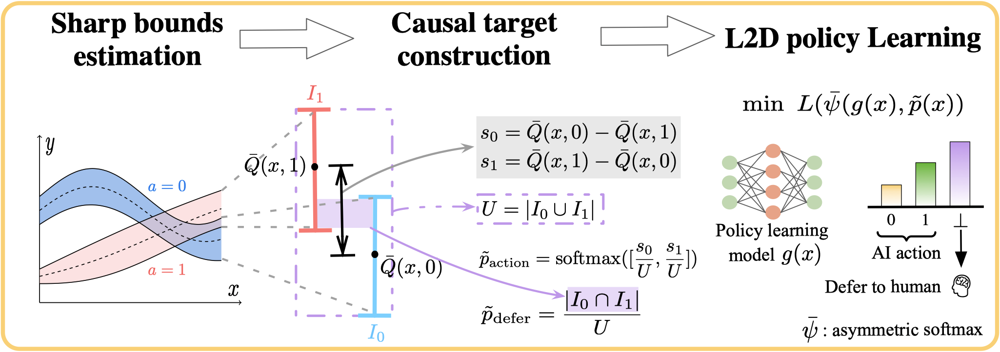

# A Causal Target for Learning to Defer under Hidden Confounding

[](https://www.python.org/)
[](https://pytorch.org/)

This repository contains the official implementation for our paper, "A Causal Target for Learning to Defer under Hidden Confounding", submitted to AAAI.

## Abstract

>Learning decision policies from confounded observational data is a challenging task in causal inference, as unobserved confounders can lead to biased or suboptimal actions when relying solely on machine learning models. A synergistic approach is learning to defer, which decides when to act itself and when to defer to a human expert with access to unobserved information. However, constructing the learning target, which defines the probability of choosing each action or deferral, remains a core challenge. To address this, we propose causal-target-based learning to defer (CTLD) framework, where the causal target is constructed from sharp bounds on potential outcomes. Specifically, the degree of overlap between these bounds determines the probability of deferral, while their relative positions and widths define the probabilities over actions. CTLD aligns model predictions with this causal target to make probabilistic decisions over actions and deferral. We present comprehensive theoretical guarantees for the learned policy and demonstrate the effectiveness of CTLD on synthetic and semi-synthetic datasets.

## Framework Overview

*Figure 1: An overview of the CTLD framework.*
---

## Requirements & Setup

To ensure reproducibility, we recommend using `conda` to create a dedicated environment.

1.  **Open the repository:**
    ```bash
    cd CTLD-main
    ```

2.  **Create and activate the conda environment:**
    This single command will create a new Conda environment named `ctld` with all the necessary dependencies installed.
    ```bash
    conda env create -f environment.yml
    ```

3.  **Activate the environment:**
    ```bash
    conda activate ctld
    ```

## Datasets

Our experiments are conducted on three datasets: **Synthetic**, **IHDP**, and **HELOC**.

-   **Synthetic Data**: Generated on the fly by the scripts in `synthetic_experiment_ctld.py`.
-   **IHDP**: The dataset `ihdp.RData` is included in the `datasets/ihdp/` directory. Our data loader handles it directly.
-   **HELOC**: The dataset `heloc_dataset_v1 (1).csv` is included in the `datasets/` directory.

No additional download or manual preprocessing steps are required to run the experiments.

## How to Reproduce Our Results

We provide scripts to run all experiments reported in the paper. The hyperparameters and settings for each experiment are managed by the `.yaml` files in the `config/` directory.

### Running CTLD (Our Method)

To run our proposed CTLD model on the different datasets, execute the corresponding experiment script:

```bash
# Run CTLD on the Synthetic dataset
python synthetic_experiment_ctld.py
```
```bash
# Run CTLD on the IHDP dataset
python ihdp_experiment_ctld.py
```
```bash
# Run CTLD on the HELOC dataset
python heloc_experiment_ctld.py
```


## Citation

```latex
@article{Li_2026_aaai,
    author={Li, Yanmin and Liu, Lihua and Wang, Xin and Mao, Zhilong and Wu, Jibing and Bao, Weidong},
    title={A Causal Target for Learning to Defer Under Hidden Confounding},
    journal={Proceedings of the AAAI Conference on Artificial Intelligence},
    volume={40},
    number={28},
    year={2026},
    month={Mar.},
    pages={23248–23255}
}
```
